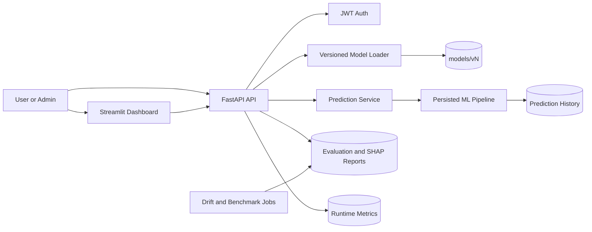

# Architecture Diagram

```mermaid
flowchart LR
    User[User or Admin] --> Dashboard[Streamlit Dashboard]
    User --> API[FastAPI API]
    Dashboard --> API
    API --> Auth[JWT Auth]
    API --> Loader[Versioned Model Loader]
    Loader --> Models[(models/vN)]
    API --> Prediction[Prediction Service]
    Prediction --> Pipeline[Persisted ML Pipeline]
    Pipeline --> History[(Prediction History)]
    API --> Reports[(Evaluation and SHAP Reports)]
    API --> Metrics[(Runtime Metrics)]
    Monitor[Drift and Benchmark Jobs] --> Reports
```
