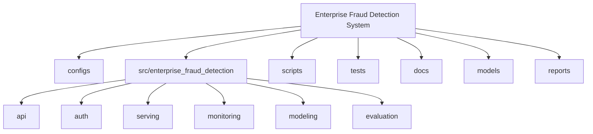

# Folder Structure Diagram

```mermaid
graph TD
    Root[Enterprise Fraud Detection System]
    Root --> Config[configs]
    Root --> Source[src/enterprise_fraud_detection]
    Root --> Scripts[scripts]
    Root --> Tests[tests]
    Root --> Docs[docs]
    Root --> Models[models]
    Root --> Reports[reports]
    Source --> API[api]
    Source --> Auth[auth]
    Source --> Serving[serving]
    Source --> Monitoring[monitoring]
    Source --> Modeling[modeling]
    Source --> Evaluation[evaluation]
```
