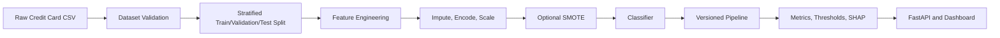

# ML Pipeline Diagram

```mermaid
flowchart LR
    Raw[Raw Credit Card CSV] --> Validate[Dataset Validation]
    Validate --> Split[Stratified Train/Validation/Test Split]
    Split --> Features[Feature Engineering]
    Features --> Preprocess[Impute, Encode, Scale]
    Preprocess --> Sample[Optional SMOTE]
    Sample --> Model[Classifier]
    Model --> Version[Versioned Pipeline]
    Version --> Evaluate[Metrics, Thresholds, SHAP]
    Evaluate --> Serve[FastAPI and Dashboard]
```
