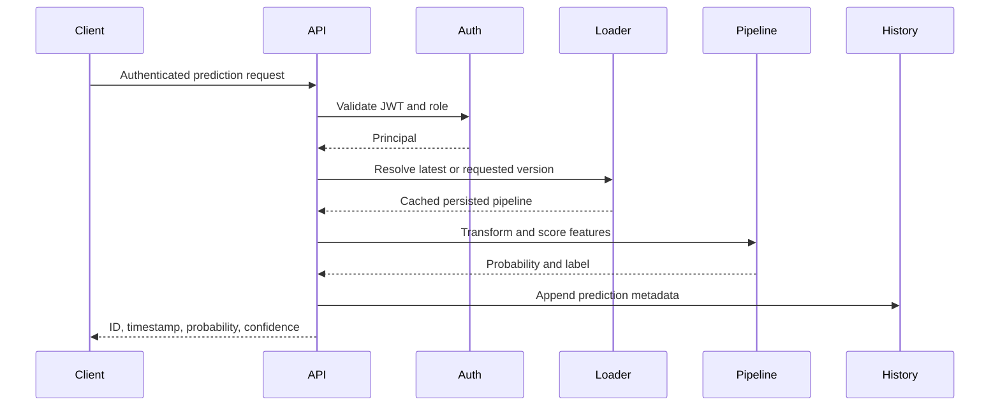

# Prediction Flow Diagram

```mermaid
sequenceDiagram
    participant Client
    participant API
    participant Auth
    participant Loader
    participant Pipeline
    participant History
    Client->>API: Authenticated prediction request
    API->>Auth: Validate JWT and role
    Auth-->>API: Principal
    API->>Loader: Resolve latest or requested version
    Loader-->>API: Cached persisted pipeline
    API->>Pipeline: Transform and score features
    Pipeline-->>API: Probability and label
    API->>History: Append prediction metadata
    API-->>Client: ID, timestamp, probability, confidence
```
