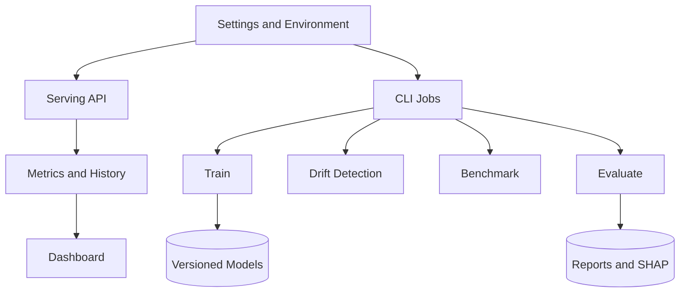

# System Flow Diagram

```mermaid
flowchart TD
    Config[Settings and Environment] --> API[Serving API]
    Config --> Jobs[CLI Jobs]
    Jobs --> Train[Train]
    Jobs --> Evaluate[Evaluate]
    Jobs --> Drift[Drift Detection]
    Jobs --> Bench[Benchmark]
    Train --> Versioned[(Versioned Models)]
    Evaluate --> Reports[(Reports and SHAP)]
    API --> Runtime[Metrics and History]
    Runtime --> Dashboard[Dashboard]
```
